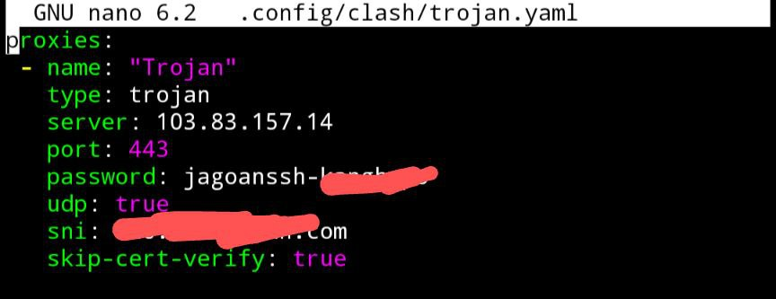
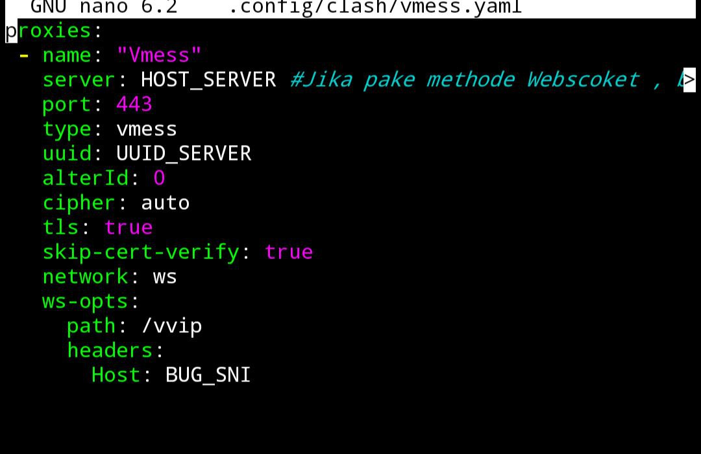
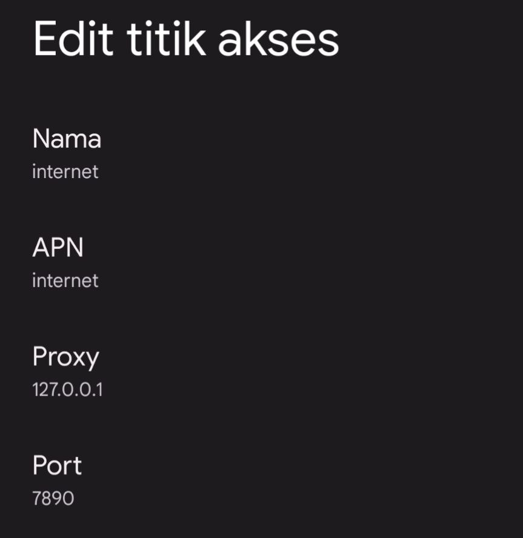
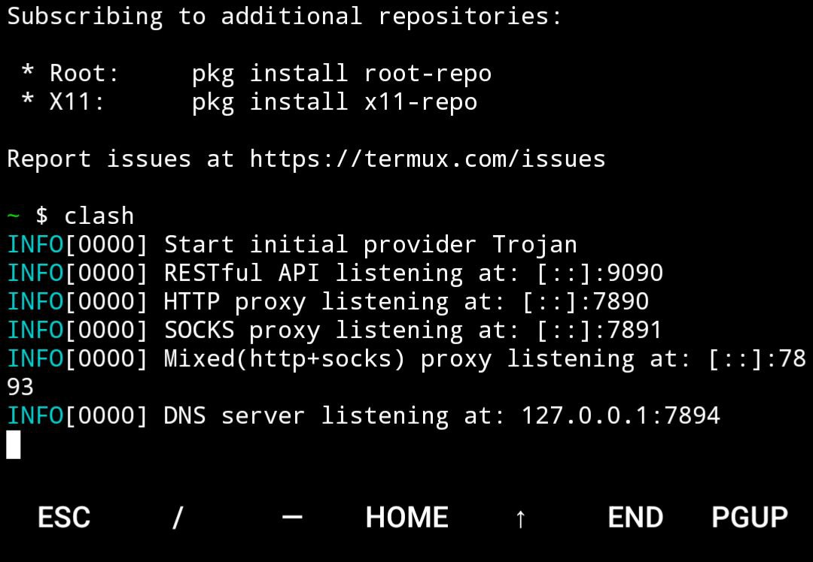
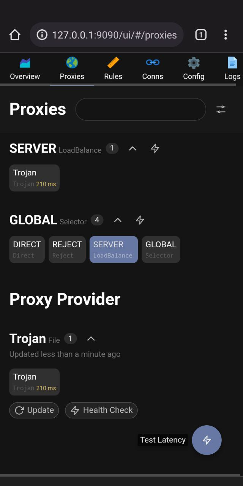

+++
	title = "install Openclash di Termux"
	date = 2022-04-05T14:17:34Z
#	description = "" # Used by description meta tag, summary will be used instead if not set or empty.
	robotsdisallow = false
	featured = false
	draft = false
	comment = true
	toc = true
	reward = true
	pinned = false

		categories = [
			"OpenClash"
		]

		tags = [
			"Termux"
		]

		series = [
			"Artikel"
		]

		images = ["/images/openclash-termux.png"]

		aliases = [
			"/Install-on-Termux"
		]
+++

OpenClash merupakan tool inject yang segudang bermanfaat pasalnya Openclash bisa memisahkan trafik, multi accout inject dan lain sebagai nya.
<!--more-->
- - -

- - -

Pada kesempatan kali ini Admin akan membagikan sebuah cara yang lumayan bermanfaat buat kalian yang ingin coba menggunakan Openclash di Android dengan bantuan aplikasi Termux pastinya tanpa root.

# Cara install Openclash di Termux Android

## Download Termux
- Gunakan [Termux Version 0.118.0](https://f-droid.org/en/packages/com.termux/) yang tersedia di f-droid
## Ketikan perintah install OpenClash
Pastikan ada koneksi internet copy paste satu persatu (wajib) supaya meminimalisir terjadinya error.
```bash
pkg update -y
pkg upgrade
pkg install nano
pkg install git
git clone https://github.com/lycoxz/ClashForTermux.git
cd ClashForTermux
bash install.sh
cd
```
## Setting akun



### Setting Trojan
```bash
nano .config/clash/trojan.yaml
```

simpan dengan CTRL +X Y Enter

### Setting Vmess
```bash
nano .config/clash/trojan.yaml
```

simpan dengan CTRL +X Y Enter

## Setting Proxy dan Port di APN Android

> APN: internet
>
> Proxy : 127.0.0.1
>
> Port : 7890



## Running Openclash di Termux

Untuk menjalankan openclash di termux cukup gunakan perintah.
```bash
clash
```


Dan untuk masuk ke yacd copy paste ini di chrome `127.0.0.1:9090/ui/#/proxies`

Atau bisa menggunakan [Helmiwrt APK](https://sfile.mobi/1MHpkOSfgAu7)



Nah seperti itu cara install Openclash di andorid dengan termux tanpa root 

source : [https://github.com/lycoxz/ClashForTermux](https://github.com/lycoxz/ClashForTermux)


